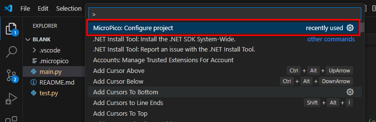
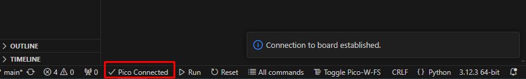
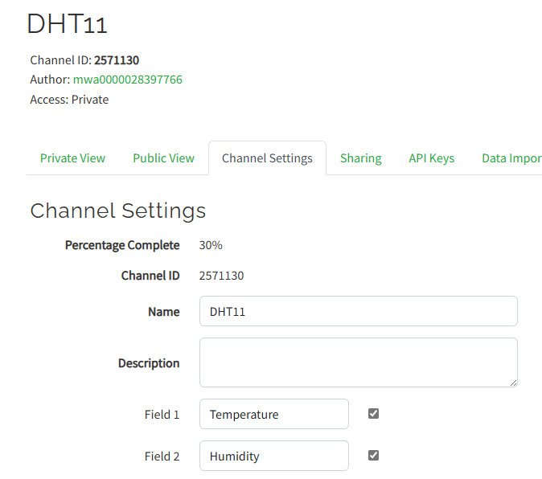
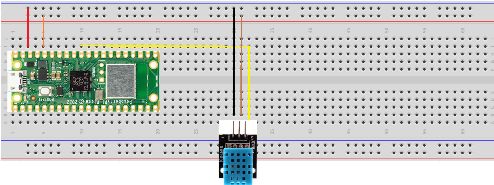
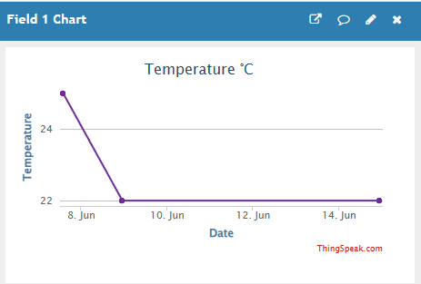
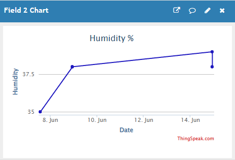
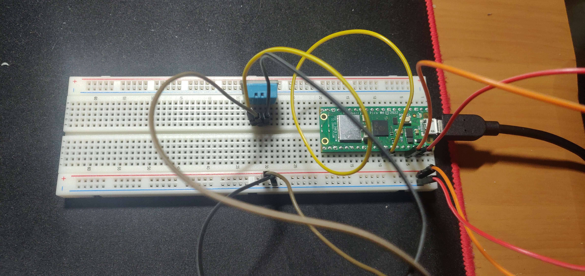
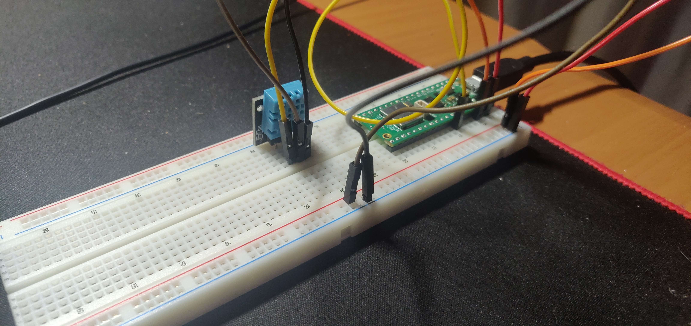

# Temperature and humidity sensor measurer

Project for the course Introduction to Applied IoT, Summer 2024

**Name:** Eldaras Zutautas <br>
**Student:** ez222eq

# Short project overview
For this project, I constructed a sensor node using a Raspberry Pi Pico W that reports temperature and humidity every hour to ThingSpeak, a free service that facilitates communication with internet-enabled devices.

**Approxiamtion of time needed for the project:**

Up to 2-3 hours total

# Objective
**Reasons for choosing the project:**
I chose this project because I've always felt that my room becomes very dry during the summer. I wanted to verify this, so I decided to create a sensor node to measure the actual humidity levels.

**Purposes of the project:**
The main objective of this project is twofold. Firstly, it aims to provide a learning experience about the Internet of Things (IoT), including understanding how to construct an IoT device and connect it to a platform for visualizing its data. Secondly, it seeks to manage and monitor the room's humidity and temperature.

**Insights gained by doing the project:**
The project offers an opportunity to gain an understanding of fundamental concepts in IoT and electrical circuits, providing valuable insights into these areas.

# Material
Component | Purpose    
-| -|
ESP8266 | A microcontroller used for data collection, data transfer, and data analysis. 
DHT11 | A sensor used for mesuring the humidity in the air asweel as the temperature 
5x Jumper wires | Wires for connecting the different components
Breadboard 800 points | A board used to easy connect the sensors without soldering 
Micro USB cable | Connection between Raspberry Pi Pico and a computer

I bought the Linnaeus Development kit for 399 SEK, so it had all of these components included.


# Computer setup
**Setting up the IDE:**

The first step was to decide which IDE to use. I chose Visual Studio Code. After installing it, I also installed the MicroPython extension to work with the Raspberry Pi Pico.

After that we need to configure the project for the Pico. That is why we use extension to do so.



After the configuration a ".micropico" config was created, therefore it means that the configuration was initialized correctly. From this point, we can try to connect the Raspberry Pi Pico to a computer and see, if our IDE detects it.



Note: it is mandatory to add a boot setup to Raspberry Pi Pico or else it will not work. Furthermore, the new updates for Pico would not detect the Pico, therefore had to use older versions.

In this project, I used the website https://ThingSpeak.com. By using ThingSpeak, you can share your sensor data on their platform and visualize it on a graph along with timestamps. This enables you to conveniently access your sensor readings from any location worldwide.

Next step is creating a new channel on Thingspeak and getting and API key for uploading the data. 


You are now ready to run your code on the development board. To upload the code, follow these steps:

1. Open the Visual Studio Code with given code.
2. Replace the placeholders in the code with your actual SSID (WiFi name), WiFi password, and API key.
3. Make sure you have assembled the circuit according to the circuit diagram.
4. Connect the development board to your computer.
5. Select the appropriate board pin in the Raspberry Pi Pico.
6. Click on the 'Run' button to compile and run the code.
7. See and wait for the Raspberry Pi Pico to connect to the internet and send data to ThingSpeak.


# Putting Everything together
The setup of the device and the wiring is shown down below



# Platform
For this project, I chose ThingSpeak because it is a free cloud service that meets my project's needs effectively. ThingSpeak offers user-friendly features for real-time data visualization on its online dashboard, enabling users to select from multiple display formats like diagrams and gauges. Moreover, it supports online data analysis through its channels, making data analysis straightforward and accessible.

# The code
```
import network
import time
import machine
import urequests
import dht

# Wi-Fi credentials
SSID = ''
PASSWORD = ''

# ThingSpeak settings for data logging
WRITE_API_KEY = ''
THINGSPEAK_URL = 'https://api.thingspeak.com/update'

# Function to connect to a Wi-Fi network
def connect_to_wifi(ssid, password):
    wlan = network.WLAN(network.STA_IF)  # Create a WLAN station interface
    wlan.active(True)  # Activate the interface
    wlan.connect(ssid, password)  # Connect to the specified Wi-Fi network
    
    max_wait = 10  # Maximum wait time for connection in 5-second intervals
    while max_wait > 0:
        if wlan.status() == network.STAT_GOT_IP:  # Check if connected and got IP
            print('Connected to Wi-Fi')
            print('IP Address:', wlan.ifconfig()[0])  # Print the IP address
            return True  # Return True if connected
        max_wait -= 1
        print('Waiting for connection...')
        time.sleep(5)  # Wait for 5 seconds before retrying
    
    print('Failed to connect to Wi-Fi')
    return False  # Return False if unable to connect

# Function to send data to ThingSpeak
def send_to_thingspeak(temperature, humidity):
    try:
        # Construct the URL with the temperature and humidity values
        url = f"{THINGSPEAK_URL}?api_key={WRITE_API_KEY}&field1={temperature}&field2={humidity}"
        response = urequests.get(url)  # Send a GET request to ThingSpeak

        # Print response status and headers
        print("HTTP/1.1", response.status_code, response.reason)
        print(f"Date: {response.headers.get('Date')}")
        print(f"Content-Type: {response.headers.get('Content-Type')}")
        print(f"Content-Length: {response.headers.get('Content-Length')}")
        print(f"Connection: {response.headers.get('Connection')}")
        print(f"Status: {response.status_code} {response.reason}")
        print(f"Cache-Control: {response.headers.get('Cache-Control')}")
        print(f"Access-Control-Allow-Origin: {response.headers.get('Access-Control-Allow-Origin')}")
        print(f"Access-Control-Max-Age: {response.headers.get('Access-Control-Max-Age')}")
        print(f"X-Request-Id: {response.headers.get('X-Request-Id')}")

        response.close()  # Close the response
    except Exception as e:
        print("Failed to send data to ThingSpeak:", e)  # Print error if request fails

# Main function to manage the process
def main():
    if not connect_to_wifi(SSID, PASSWORD):  # Connect to Wi-Fi
        return  # Exit if Wi-Fi connection fails

    dht11_pin = machine.Pin(27)  # Define the pin connected to the DHT11 sensor
    dht11_sensor = dht.DHT11(dht11_pin)  # Create a DHT11 sensor object

    while True:
        try:
            dht11_sensor.measure()  # Measure temperature and humidity
            temperature = dht11_sensor.temperature()  # Get the temperature
            humidity = dht11_sensor.humidity()  # Get the humidity
            print(f"\nTemperature: {temperature} C, Humidity: {humidity}%")
            
            send_to_thingspeak(temperature, humidity)  # Send data to ThingSpeak
            time.sleep(900)  # Wait for 15 minutes (900 seconds) before next measurement
        except OSError as e:
            print("Failed to read sensor:", e)  # Print error if sensor reading fails

main()  # Run the main function
```

1. **connect_to_wifi(ssid, password):** This method connects the device to a Wi-Fi network using the provided SSID and password. It creates and activates a WLAN station interface, then tries to connect to the Wi-Fi network and waits for up to 50 seconds (10 intervals of 5 seconds each). If it successfully connects and gets an IP address, it prints the IP address and returns True. If it fails to connect within the maximum wait time, it prints a failure message and returns False.

2. **send_to_thingspeak(temperature, humidity):** This method sends temperature and humidity data to the ThingSpeak cloud service. It constructs a URL with the provided temperature and humidity values, and the ThingSpeak API key, then sends a GET request to the constructed URL. It prints the HTTP response status and various headers for debugging purposes. If the request fails for any reason, it catches the exception and prints an error message.

3. **main():** This is the main function that orchestrates the entire process. It first attempts to connect to the Wi-Fi using the connect_to_wifi method. If the Wi-Fi connection is successful, it proceeds to read temperature and humidity data from a DHT11 sensor. It initializes the DHT11 sensor on a specified GPIO pin (pin 27 in this case). It enters an infinite loop where it measures temperature and humidity using the DHT11 sensor, prints the temperature and humidity values, sends these values to ThingSpeak using the send_to_thingspeak method, and waits for 15 minutes (900 seconds) before taking the next measurement. If there's an error reading from the sensor, it catches the exception and prints an error message.

<mark>Terminal output of establishing a Wi-Fi connection, and sending the data to the ThingSpeak server using an HTTP POST request</mark>
```
Temperature: 22 C, Humidity: 38%
HTTP/1.1 200 b'OK'
Date: Fri, 14 Jun 2024 20:07:24 GMT
Content-Type: text/plain; charset=utf-8
Content-Length: 2
Connection: close
Status: 200 b'OK'
Cache-Control: max-age=0, private, must-revalidate
Access-Control-Allow-Origin: *
Access-Control-Max-Age: 1800
X-Request-Id: 6083e79d-2c9a-45aa-bcbd-2eb701e8d707
```

# Transmitting the data / connectivity
I opted to send data at hourly intervals to monitor the humidity levels in my room. This frequency is ideal for determining if the environment is too dry.

For wireless communication, I used WiFi because my microcontroller is positioned near my home router, eliminating the need for a longer-range protocol. WiFi also incurs no recurring costs, offers low latency, and has minimal bandwidth restrictions, making it the optimal choice.

To transmit the data, I used the Hypertext Transfer Protocol (HTTP). This protocol enables the sensor data to be sent to ThingSpeak. HTTP facilitates communication between a client and server using a request-response model. I specifically utilized the POST request method, which allows data to be sent to the server for creating or updating resources, such as publishing sensor readings.

# Presenting the data
The Thingspeak dashboard is configured with two data fields: one for humidity and one for temperature. Each field is accompanied by a diagram that displays the respective sensor values every 15 minutes. The humidity data is presented in percentages, while the temperature data is shown in Celsius.




# Finalizing the design




# Final thoughts

The project was successful, I managed to connect everything and send date to ThingSpeak. The programming with python was not hard, because I had written on it before. Connecting everything was also easy, because I also had some of the experience with Raspberry Pi Pico. And of course now I know that my room has enough humidity.
